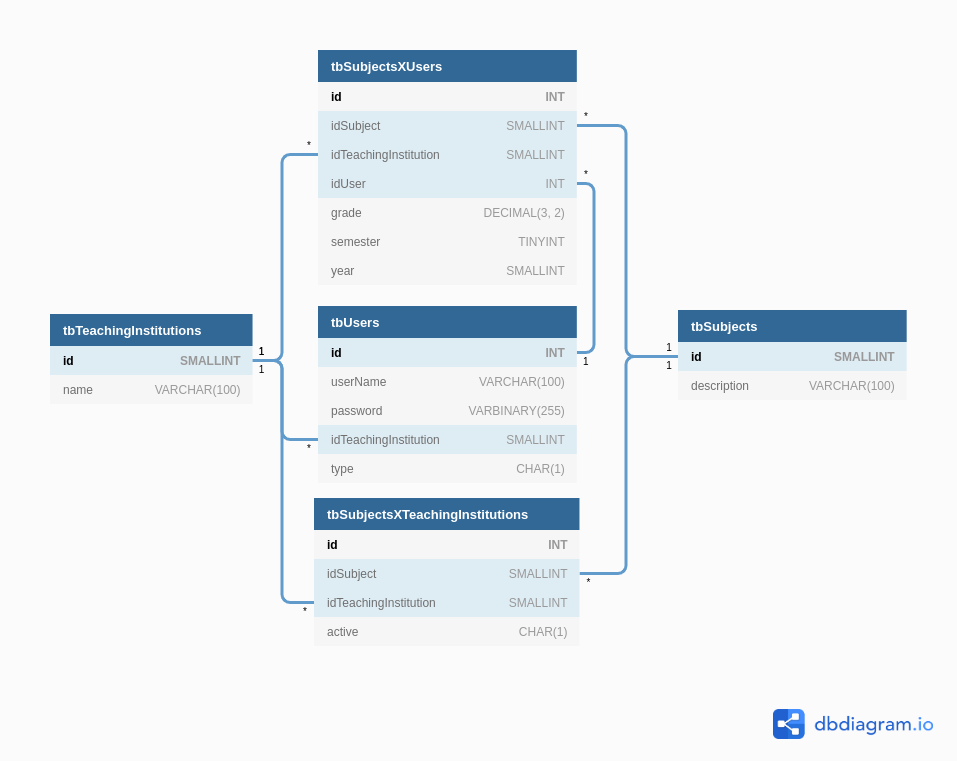

# Proj notas
###### (precisamenos pensar em um nome melhor)

## Objetivo

Proporcionar tanto para alunos como para instituições de ensino uma visualização da média das matérias que cada um possuí.

**Instituição de ensino:** Irá informar quais são as disciplinas que ela possuí em suas grades curriculares e emitir relatórios, em formas de gráficos, sobre sua média de nota em relação as outras instituições.

**Aluno:** Irá informar em qual instituição de ensino estuda e dentre todas que ela possua, escolher as que ele está tendo, ou teve, em um determinado ano e semestre, após ter suas metérias escolhidas poderá informar sua nota obtida em cada para conseguir ver como sua notá está em relação a média de sua instituição.

Para fins de mater a segunça, integridades e coisas do tipo dos alunos, não é necessário nenhum tipo de dado que possa identificá-lo, os campos para fazer os cadastro de ambos os tipos de usuário, aluno e instituição de ensino, são nome de usuário, senha e instituição.

## Ambiente de desenvolvimento

- IDE Eclipse 06-2020
- JDK 11
- Apache Maven 3.6
- Apache Tomcat 9
- MySQL 8
- Postman / Insomnia
- NodeJS 12.*
- yarn

## Tecnologias

- Font-end com React e ReactJS
- API RESTful feita com servelet
- Comunicação entre back-end e front-end via JSON
- Persistência de dados com Hibernate

## Rodando em ambiente de desenvolvimento

### Obtendo projeto

```bash
git clone https://github.com/NathanReis/FTT-ProjNotas.git

cd FTT-ProjNotas
```

### Banco de dados

Na pasta referenceFiles, que está na raiz do repositório, tem o script "db.sql", executá-lo por completo para criar a base e dados e o usuário que está configurado no Hibernate.

### API

Abrir a pasta "api" no Eclipse e rodar o projeto.
**URL base:** http://localhost:8080/projnotas.api

### Front-end WEB

```bash
cd N2-Web/my-app

yarn

yarn start
```

## Modelo de dados

